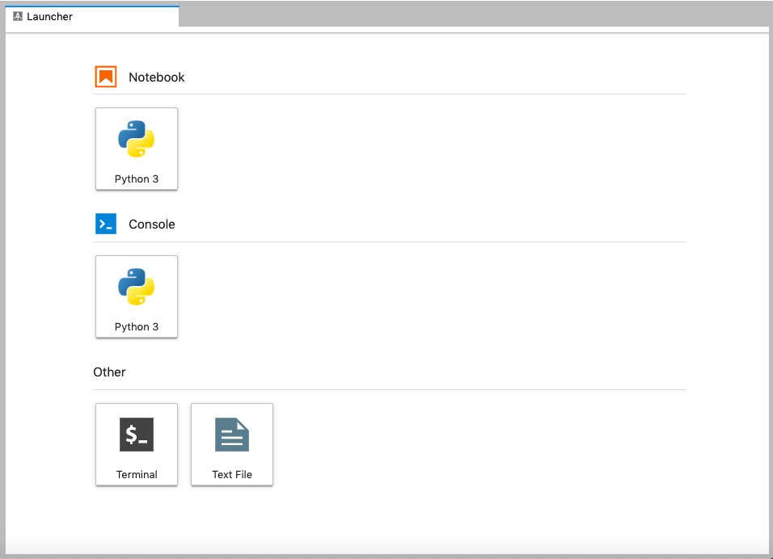

## Asking questions about a list of files

Alice now has a digital shelflist of the the files she wants to work with. Before she decides what to do with her files, she wants to understand them better.

While learning how to create filepaths, we created our first few building blocks:
* building lists of files and folders
* using `for` loops

Within an AV preservation environment, we will use these building blocks repeatedly for two common tasks:
* information gathering (analysis)
* processing (manipulation)

Frequently, these two tasks go hand in hand. We may generate monthly/quarterly/annual reports about the size of the collection for administration, and then use this information to perform actions like estimating storage needed for service copies or deciding to losslessly transcode everything.

> ## Metadata about Quicktime files
>
> If we want to make MP4s from the Quicktime files, what are some of the key pieces of information that we’ll want to ascertain before doing anything else?
> 
> > ## Solution
> > TOTAL NUMBER OF FILES! SIZE! DURATION!
> {: .solution}
{: .challenge}

As usual, we will have multiple ways to retrieve this information.
Let’s begin by reviewing a few ways Python can be used to determine some of the overarching characteristics of our media collection
* How many files do we have?
* How big are they individually and cumulatively
* What is the duration of each file/our set of files?

Just to make sure, here is the code for creating our digital shelflist.

~~~
media_list = []

for root, dirs, files in os.walk(video_dir):
    for file in files:
        if file.endswith(('.mkv', '.mov', '.wav', '.mp4', '.dv', '.iso', '.flac')):
            item_path = os.path.join(root, file)
            media_list.append(item_path)
~~~
{: .language-python}

## Finding the total size of all AV files in a directory

### os.stat

A good place to start is with os.stat, a piece of the os module that provides information on the “status” of a file.
The stat module offers a wealth of detail related to ownership, permissions, location, creation/modification times, but for our purposes, we’ll be using it to determine file sizes.

Our end goal is to write a `for` loop that collects the size of each file.
A good strategy to build towards the `for` loop is to apply the code to a single element of our list.
Let's see how `os.stat` works on the first path in `media_list`.

~~~
os.stat(media_list[0]).st_size
~~~
{: .language-python}

The result is a number. It's important to notice that it doesn't have quote marks around it like a string.

> ## Python Syntax: Integers
>
> In Python, integers consist of numbers `0` through `9` and nothing else.
> No decimal points.
> No quotation marks.
> You can do math with an integer: `2 + 2 = 4`
> But, if you do the same math with strings, you will get a very different result: `'2' + '2' = '22'`
{: .callout}

> ## Numbers that don't act like numbers
>
> What are examples of numbers that you use that you wouldn't want to do math with?
> 
> > ## Solution
> > Barcodes often consist of numbers, but it wouldn't make sense to add 2 barcodes together, or compare them to see if one is larger than the other.
> > It can be much easer to store barcodes as strings, despite how much they look like integers.
> {: .solution}
{: .challenge}

We can adapt this code into a `for` loop to look at all of the files.

~~~
for item in media_list:
    print(os.stat(item).st_size)
~~~
{: .language-python}

This list would be more useful if we know which number is associated with which file.
One way to do this is by using string formatting.

~~~
for item in media_list:
    print('File: {}, Size: {}'.format(item, os.stat(item).st_size))
~~~
{: .language-python}

But even better than descriptive print statements is gaining an aggregate sense of the data we have on-hand.
To accomplish that, we will save the sizes to a list, instead of immediately printing them out. 

~~~
size_list = [ ]

for item in media_list:
    size_list.append(os.stat(item).st_size)
~~~
{: .language-python}

Now, with our file size list, we can add our numbers together with the `sum` function.

~~~
sum(size_list)
~~~
{: .language-python}

While os.stat provides us with the size (number of bytes as integers) of our files, it can be very hard to tell if you're working with 10's of terabytes (`10000000000000`) or 100's of gigabytes (`100000000000`).

In writing, we use commas to help with this problem, but computers don't need or want the help of commas.
If we want to express the total number of bytes as terabytes, we need to ask for that ourselves.

For example:

~~~
totalsize = 16255932760371
totalsize/(1000 ** 4)
~~~
{: .language-python}

~~~
16.255932760371
~~~
{: .output}

Here, `**` is the Python notation for an exponent, so `1000 ** 4` means 1,000,000,000,000 and `16.255932760371` is the number of terabytes

### TB vs. TiB (sidetrackkkkkkkk)
If you're wondering why we're using `1000` instead of `1024` for our math, you're asking good question.
And the answer points to a long, and honestly, quite dumb history, but it is worth taking a quick tangent.

The tl; dr is: computer scientists really love binary systems and think `2 ** 10` or `1024` is a convenient large group.
Engineers really love base-10 systems and think `10 ** 3` or `1000` is a really useful group.
For a while, both of these communities used the same prefixes for their numbers.
A computer scientist would talk about a kilobyte with 1,024 bytes and an engineer would talk about a kilobyte with 1,000 bytes.

In the 90s, they "settled" their dispute.
To talk about base-10 numbers, you should use the familiar SI (International System of Units) prefixes: kilo- (k), mega- (M), giga- (G), tera- (T), etc.)
To talk about binary numbers, you should use the binary prefixes: kibi- (ki), mebi- (Mi), gibi- (Gi), tebi- (Ti), etc.
Unfortunately, they didn't really settle the debate, and you can still find marketing materials that mix the two up.
For us, it's an important distinction as our collections grow bigger.

~~~
totalsize/(1000 ** 4)
~~~
{: .language-python}

~~~
16.255932760371
~~~
{: .output}

~~~
totalsize/(1024 ** 4)
~~~
{: .language-python}

~~~
14.784684717934397
~~~
{: .output}

16.2 TB seemingly shrank down to 14.7 TiB.
It didn't really shrink, but the units that we used to measure can change our perception.
If this is all feeling a little rabbit-holey and inane, just know: how you communicate about data does matter, especially given this long-standing historical confusion. 
If your storage provider sells storage by the TB while you calculate by the TiB, you might be surprised by your bill.
Clarity is Queen!

But as we’re working in and with Python, we should recognize that we have monster data crunching analysis/power at our fingertips, and a built-in community that has already faced similar issues.
Often, someone else has already created the tool/package that we’re in need of, so in this sense, Python could be thought of as a thieves paradise.

Instead of remembering the history of binary and base-10 number systems, we can outsource this labor by installing a package (hurry.filesize) that will do the heavy lifting for us.

#### Installing packages with pip

We’re still stuck (for the moment) in numbersland, but we’re getting to the fun stuff—leveraging the vast number of free and open tools that are available in the world of Python, and using them to turbo-charge our scripts. 

This is the realm of package management, and if any macOS users are familiar with Homebrew, the program pip plays a similar role within Python, allowing users to install “packages,” or specialized code libraries designed to perform specific, not-handled-by-default tasks.

So we’re back to importing modules, as it were, though these outside modules first require a separate installation step (via pip) before we can import and use them in our code.
As we’ve all installed Python3 via Anaconda, we’ll have pip available to us.
But, to check our installation, we can do the following.
First, open a console Terminal tab by clicking on the `+` sign in the sidebar and clicking on the `Terminal` tiles in the main area.

    

When the terminal opens, it should look like the following.
~~~
(amia19)username@computername >
~~~
{: .language-bash}

If it doesn't, you need to activate the `amia19` environment.

~~~
conda activate amia19
~~~
{: .language-bash}

Then type the following:

~~~
pip --version
~~~
{: .language-bash}

~~~
pip 19.1.1 from /usr/local/lib/pytpip 19.3.1 from /opt/anaconda3/envs/amia19/lib/python3.7/site-packages/pip (python 3.7)
Note: you may need to restart the kernel to use updated packages.hon3.7/site-packages/pip (python 3.7)
~~~
{: .output}

pip offers a lot of features, but the ones most relevant to us are related to this process of searching for, installing/uninstalling, and listing packages located in what’s called the Python Package Index, or PyPI (remember too that pip -h will direct you to handy help pages).

Let’s begin our pipping with a search, specifically a search for the `hurry.filesize` package, which alleviates that very annoying bytes-->something more understandable issue.

~~~
pip search hurry.filesize
~~~
{: .language-bash}

~~~
hurry.filesize (0.9)  - A simple Python library for human readable file sizes (or anything sized in bytes).
~~~
{: .output}

And to install hurry.filesize, we do the obvious:

~~~
pip install hurry.filesize
~~~
{: .language-bash}

To check that we’ve installed `hurry.filesize` properly, we can list all of the packages that we’ve installed via pip:

~~~
pip list
~~~
{: .language-bash}

> ## Already installed
> Your `pip install` command may report that hurry.filesize has already been installed.
> We weren't sure how well the Internet would work during this workshop, so we pre-installed it during the setup.
{: .callout}

#### Incorporating a package (hurry.filesize) into our code

Now that we’ve got `hurry.filesize` installed, how do we take advantage of the power that it offers?
By importing, that’s how!

But we’ll import in a slightly different way, with a `from X import Y` statement at the start of our code.
Why do it this way, instead of using the generic `import X`? 

When we import a module, it imports all the submodules and functions. Some modules have a lot of those, and so to use function, we need to write `module.submodule.submodule....function()`.
But, if we only need a single function from the package, we can import just that function.
Then in our code, we only have to write `function()`.
There is no right or wrong here, but there is a simplicity to not having to type as much every time we use a module.

~~~
from hurry.filesize import size, si, iec
size(totalsize, system=si)
~~~
{: .language-python}

~~~
16.2T
~~~
{: .output}

Or if we need to know the binary equivalent:

~~~
size(totalsize, system=iec)
~~~
{: .language-python}

~~~
14.7Ti
~~~
{: .output}

Underneath the hood, `hurry.filesize` does the same math we did above, divide our number by powers of 1,000 or 1,024.

## pymediainfo and collecting duration information

Let’s turn from bytes to duration, another key piece of information that we’ll often be asked to aggregate when we begin to work at scale (average duration by format can help when forecasting anticipated needs).

Here, we’ll call upon another Python package: `pymediainfo`, a Python wrapper for the open source technical metadata tool MediaInfo. 
`pymediainfo` is the shit, and though there are other ways to incorporate MediaInfo into our Python code, pymediainfo is elegant and has a relatively low bar to entry.

We’ll touch upon many of the different ways that Python + MediaInfo can assist with AV file management, but let’s start with installation and the process of gathering up the durations of our files.
In the Terminal tab, type:

~~~
pip install pymediainfo
~~~
{: .language-bash}

To use `pymediainfo` we’ll need to understand how pymediainfo creates a special class for MediaInfo track-related information. 

We won’t be going deep on classes today, but the important thing to keep in mind is that to use `pymediainfo` correctly, we need to first be able to direct it to the information we’re trying to gather. It’s essentially a weird syntax issue, but good news: we’re gonna get you started!

~~~
from pymediainfo import MediaInfo

media_info = MediaInfo.parse(media_list[0])

for track in media_info.tracks:
    print(track.track_type, track.duration)
~~~
{: .language-python}

~~~
General 468
Video 468
Audio 465
~~~
{: .output}

If we break this down into discrete units, we’ve got four key steps:

* the `import` statement, which calls up `pymediainfo`;
* running and parsing the output of MediaInfo on a single file, then storing that technical metadata to a for us to retrieve;
* looping through the `tracks` that MediaInfo reported on
* printing out, in our Jupyter notebook, the name of each track and its duration.

We can, of course, tweak this in any number of ways.
First, we can limit our printing to only the 'General' track.

~~~
for track in media_info.tracks:
    if track.track_type == 'General':
        print(track.duration)
~~~
{: .language-python}

By default, pymediainfo returns the time in milliseconds.
This is frustrating, in that we generally don't talk about a time in milliseconds.

We could, for example, have our print statement be more human-readable by using Python’s print formatting function.

~~~
for track in media_info.tracks:
    if track.track_type == 'General':
        print("Duration: {} sec.".format(track.duration / 1000.0))
~~~
{: .language-python}

So here, we ask Python to do two additional things: (1) format the print statement to read, “Duration: X sec.”; and (2) divide the milliseconds value by 1000, to return seconds.

Finally, we can use a `for` loop to get this information for every file.

~~~
for item in media_list:
    media_info = MediaInfo.parse(item)
    for track in media_info.tracks:
        if track.track_type == "General":
            print("Duration: {} sec.".format(track.duration / 1000.0))
~~~
{: .language-python}

~~~
Duration: 0.468 sec.
Duration: 0.111 sec.
Duration: 0.267 sec.
Duration: 0.568 sec.
Duration: 1.085 sec.
Duration: 0.337 sec.
Duration: 0.935 sec.
...
~~~
{: .output}

As an alternative, we could take advantage of MediaInfo’s already verbose output, and if we recall, when we ask MediaInfo for a “full” report (mediainfo -F my_movie.mov), we receive a few different expressions of the same value:

In its own roundabout way, pymediainfo allows us to access these various options:

~~~
media_info = MediaInfo.parse(media_list[0])

for track in media_info.tracks:
    if track.track_type == "General":
        print(track.to_data()["other_duration"])
~~~
{: .language-python}

~~~
['317 ms', '317 ms', '317 ms', '00:00:00.317', '00:00:00;09', '00:00:00.317 (00:00:00;09)']
~~~
{: .output}

If we wanted to select a single choice from this list output, we could subscript in the following way (while keeping in mind that Python is always zero-indexed):

~~~
for track in media_info.tracks:
    if track.track_type == "General":
        print(track.to_data()["other_duration"][3])
~~~
{: .language-python}

~~~
00:00:00.317
~~~
{: .output}

This is an even more human-readable option, but when we try to sum up the entire collection, that human-readability can be a liability.

~~~
durations = []

for item in media_list:
    media_info = MediaInfo.parse(item)
    for track in media_info.tracks:
        if track.track_type == "General":
            durations.append(track.to_data()["other_duration"][3])

sum(durations)
~~~
{: .language-python}

> ## Python Syntax: Function Errors
>
> The sum function is designed to work with numbers, so if our list contains strings, Python will print out an error message.
>
> ~~~
> sum([2, 2, '2']) 
> ~~~
> {: .language-python}
>
> ~~~
> TypeError: unsupported operand type(s) for +: 'int' and 'str'
> ~~~
>
> Some functions have strong requirements for what kind of data can be used as an argument.
> When you see an error like this, read it and see if it makes sense.
> Most errors messages will start with the most general information and get more specific.
> * `TypeError` - the function can't work with the type of data provided
> * `unsupported operand type(s) for +` - the function specifically can't use `+` for the data provided
> * `'int' and 'str'` - `+` cannot be used for a mixture of integers and strings
>
> Programmers don't always write understandable error message, but copying-and-pasting your error message to a search engine can often help you find people asking the same questions and getting better explanations.
>
{: .callout}

> ## Python Syntax: Finding help for Python functions
>
> If you run into an error, Python offers built-in help pages that can yield insight into the inner-workings of different modules, classes, functions, etc. Google/Stack Exchange are always a good place for additional information, but sometimes it’s most handy to get the lowdown directly from the source itself.
>
> So let’s use the sum function, and walk through how to pull up Python’s help pages.
> Type the word ‘help’ and follow it with the item about which you’d like more information, contained within parentheses:
>
> ~~~
> help(sum)
> ~~~
> 
> ~~~
> Help on built-in function sum in module builtins:
> 
> sum(iterable, start=0, /)
>    Return the sum of a 'start' value (default: 0) plus an iterable of numbers
>    
>    When the iterable is empty, return the start value.
>    This function is intended specifically for use with numeric values and may
>    reject non-numeric types.
> ~~~
> 
> To exit the help pages, type the following:
>
> quit()
{: .callout}

While calculating is easier with milliseconds (integers), reading is far easier to do in HH:MM:SS:MS (strings).
Our challenge is to do all of the calculating with milliseconds and then print the final result as HH:MM:SS:MS.
Now, this being the wide world of Python, there is a module (called datetime) that we could use to transform our HH:MM:SS:MS into a shape (called a datetime object) that could be manipulated, but for now, let’s stick to a more manageable solution.

As with our summing of bytes, we can easily make a few small changes to our code to add our individual durations to a new list:

~~~
durations = []

for item in media_list:
    media_info = MediaInfo.parse(item)
    for track in media_info.tracks:
        if track.track_type == "General":
            durations.append(track.duration)

sum(durations)
~~~
{: .language-python}

~~~
69327
~~~
{: .output}

To create something more human readable, we could perform a series of equations to transform this value into HH:MM:SS:MS:

~~~
total_duration = sum(durations)

hours = total_duration // 3600000
minutes = (total_duration % 3600000) // 60000
seconds = (total_duration % 60000) // 1000
ms = total_duration % 1000
human_duration = "{:0>2}:{:0>2}:{:0>2}.{:0>3}".format(hours, minutes, seconds, ms)

human_duration
~~~
{: .language-python}

~~~
'00:01:09.327'
~~~
{: .output}

> ## Challenge
>
> How would you find the average duration of the files?
>
> > ## Solution
> > ~~~
> > sum(durations)/len(durations)
> > ~~~
> > {: .language-python}
> {: .solution}
{: .challenge}

## Putting it all together

We can put all of the pieces together, using `hurry.filesize`, `pymediainfo`, a slew of `for` loops, multiple lists, `os.walk`, `endswith` statements, and a formatted print statement to result in a script that will comb through our directory, count up all of the relevant media files, and let us know: (1) the total number of files, (2) the average duration in human readable form, and (3) the average file size, in the SI system.

~~~
media_list = [ ]
sizes = []
durations = []

for root, dirs, files in os.walk(video_dir):
    for file in files:
        if file.endswith(('.mkv', '.mov', '.wav', '.mp4', '.dv', '.iso', '.flac')):
            item_path = os.path.join(root, file)
            media_list.append(item_path)

for item in media_list:
    media_info = MediaInfo.parse(item)
    for track in media_info.tracks:
        if track.track_type == "General":
            durations.append(track.duration)
            sizes.append(track.file_size)

avg_duration = int(sum(durations)/len(media_list))

hours = avg_duration // 3600000
minutes = (avg_duration % 3600000) // 60000
seconds = (avg_duration % 60000) // 1000
ms = avg_duration % 1000
human_duration = "{:0>2}:{:0>2}:{:0>2}.{:0>3}".format(hours, minutes, seconds, ms)

print("Total Number of Files: {} ; Average Duration: {}; Average Size: {}".format(len(media_list), human_duration, size(sum(sizes)/len(media_list), system=si)))
~~~
{: .language-python}

~~~ 
Total Number of Files: 135 ; Average Duration: 00:00:00.513; Average Size: 9M
~~~
{: .output}



